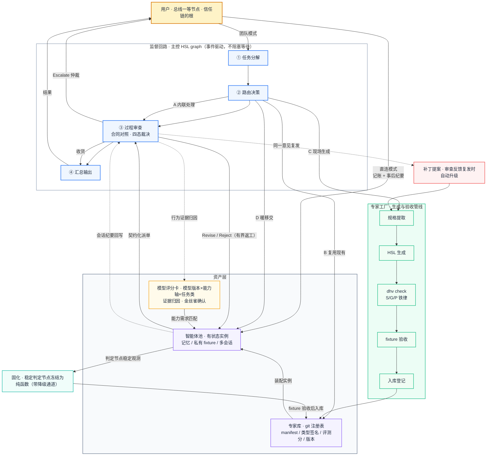

<div align="center">

# ORG — Organization Harness

**基于 HSL 的组织化多智能体系统 · 子智能体可生成、可验收、可复用、可演进**

[](LICENSE)
[](https://github.com/myh2026/org-harness/releases)
[](https://github.com/myh2026/harness-specification-language)
[](https://github.com/myh2026/harness-specification-language/blob/main/toolchain/hsl-spec/BNF.md)
[](https://github.com/myh2026/org-harness/actions/workflows/ci.yml)
[](https://github.com/myh2026/org-harness/actions/workflows/release.yml)

</div>

---

> **一句话定位**：现有框架把子智能体当作一次性函数——任务结束即销毁，不留任何资产；ORG 把子智能体当作**工程资产**管理——结构用 HSL 描述、生成经编译期校验与 fixture 验收、任务结束沉淀回库，使系统能力随使用持续增强。

> **当前状态**：v0.1.0 可运行实现。信封契约、主控监督回路、工厂闸门（真实 `dhv check` + fixture 验收）、池化（轻档）、直连记账、知识补丁、评分卡归因、固化管线（精确匹配档）全部落地并可复现演示（`org demo`，1.6s 三连跑）。仓库采用「源码（`hsl/`）+ 编译产物（`dist/`，入库）+ CI/CD（GitHub Actions：check / 三连跑冒烟 / 产物回写 / tag 发布）」布局。路线图后半段见[实施路线图](#-实施路线图)与[已知边界](#%EF%B8%8F-已知边界诚实声明)。

## ✨ 为什么是 ORG

现有 Agent 框架回答的是「怎么派一个子任务」，ORG 回答的是「怎么让子智能体成为可积累的组织能力」。它把四件通常散落在框架约定、提示词工程和人工经验里的东西，收进一个可校验的系统：

- **专家是流程，不是人设** —— 现有 sub-agent 体系的「专家」= 通用 ReAct 循环 + 系统提示词 + 工具白名单，只贡献人设不贡献流程。ORG 用 HSL `graph` 把专家的标准作业程序形式化为可校验的拓扑：node 是物理依赖、edge 是带守卫的消息通道、循环是有穷尽性要求的程序结构。主控与子智能体之间不再共用同一套运行时约定，只对齐类型化接口。
- **生成必须过闸门** —— 「现场生成一个智能体」在无验收体系的框架里等于把未经检查的代码直接上线。ORG 的生成管线规定：LLM 产出的 `.hsl` 源码必须先通过 `dhv check`（S 严格性 / G 拓扑 / P 投射铁律），再通过 scripted fixture 行为验收，才能注册上岗。机器生成的机器代码，第一次拥有确定性的质量闸门。
- **权限是编译期与审计事件的组合** —— `#[capability(...)]` 注解使最小权限原则在编译期可执行；运行期的临时授权、直连访问、能力变更全部作为审计事件记录。委托关系不再依赖提示词自觉，而是可检查、可追溯的工程约束。
- **任务结束是资产沉淀的开始** —— 每个任务都可能留下多类资产：新专家、验收 fixture、任务记忆、补丁记录。同样的任务第二次到来时，成本结构与第一次完全不同。系统的核心竞争力不在单次执行的聪明程度，而在资产层的增长率。
- **成熟流程固化为代码** —— 运行时把输出长期稳定的判定节点冻结为纯 HSL 函数（带自动降级通道），专家的单位成本随成熟度递减。agent 不只是会写代码，它会随着被使用而逐渐变成代码——HSL 是这个过程的编译目标。

## 🔁 完整流程图



怎么读这张图：**蓝色管线是监督回路（主控的四个阶段），紫色是资产层（库与池），绿色是工厂管线（生成与验收），红色是补丁通路，琥珀色是模型评分卡与证据归因，青色是固化通路。** 用户既是团队模式的委托方，也可以经直连通道直接访问池中专家；工厂同时服务两条生产线——新专家生成与老专家补丁，共用同一道验收闸门；监督回路的行为证据持续归因到评分卡，评分卡反过来决定池中实例的模型匹配。

### 一次典型任务的走读（v0.1.0 已可复现，`org demo`）

1. 用户下达任务：「抓取某站点近一周公告，输出结构化表格」；
2. 主控分解为 检索 / 解析 / 校验 三个子任务，**随即**向用户发出澄清问题（输出格式、字段偏好）——人类思考时间与机器执行时间重叠，而非串行；
3. 路由：检索子任务琐碎且强依赖主控上下文 → **A 内联**；解析子任务在专家库命中 → **B 复用** notice-parser；校验子任务无匹配专家 → **C 现场生成**，生成物通过真实 `dhv check`（结构铁律）与 fixture 验收（行为闸门）后注册入池；
4. 派单契约先行：每份工单写明交付物规格、验收标准、预算水位与返工上限；
5. 主控过程审查发现校验专家覆盖不足，四态裁决为 `Revise`——在早期拦截，而不是汇总后发现全量返工；
6. 任务结束：新专家、验收样本、固化 memo 沉淀入库（git 注册表提交留痕）；
7. **第二次同类任务**（run B）：校验专家直接复用（零工厂成本）；解析专家的日期归一化判定节点持续命中 memo（模型调用 5 → 1）；「覆盖不足」审查意见复发两次 → 自动升级为**补丁提案**，经 check + smoke 闸门合入 record-validator@1.0.1（git 留痕）；
8. **第三次同类任务**（run C）：判定节点 5/5 全命中（**零模型调用**）；补丁版专家首验即收（**零返工**）——蓝绿发布生效，系统单位成本随使用递减。

实测数据（scripted 模式，1.6s 三连跑）：model_calls 衰减 **5 → 1 → 0**，返工 **1 → 1 → 0**，git 注册表三个提交（template → mint → patch）即资产层的增长率账本。

## 🏗️ 架构总览（六大部件）

| 部件 | 职责 | 关键机制 | v0.1.0 |
|:---|:---|:---|:---|
| **主控（编排与监督）** | 分解、路由、审查、汇总 | 事件拓扑（microkernel）；批量澄清早发；任务契约先行 | ✅ hsl/org.hsl |
| **路由器** | 每个子任务四选一 | 类型兼容静态可查；纯函数判定 | ✅ hsl/router/policy.hsl |
| **专家库（Registry）** | 磁盘资产，不占运行时资源 | git 注册表；manifest 索引；能力交集 + 语义粗排检索 | ✅ hsl/registry/manifest.hsl |
| **专家工厂（Factory）** | 新品生成 + 补丁合入，同一闸门 | 提取 → 生成 → dhv check → fixture 验收 → 登记 | ✅ hsl/factory/pipeline.hsl |
| **智能体池（Pool）** | 运行中的有状态实例 | 生命周期状态机；双执行车道（进程内/嵌套=蓝绿） | ✅ 轻档 hsl/pool/lifecycle.hsl |
| **直连前台** | 用户可寻址池内专家 | 记账 + 纪要回写强制执行 | ✅ 单轮 hsl/pool/direct.hsl |

### 主控与监督回路

**主控是全系统唯一手写、唯一不经工厂管线的组件——它是内核。** 主控是一个 HSL `graph`，监督回路的四个阶段以事件拓扑组织（`registry → pool → policy → pool → journal → {pool, scorecard}`，环上全部带 on Guard）。

监督的核心机制是**任务契约**：派单前先写明交付物规格、验收标准、预算水位、返工上限与升级路径。审查因此成为「对照验收标准的有限动作」而非全程盯守，裁决为四态：

```
Accept（收货） │ Revise{意见}（返工，计一次） │ Reject{理由}（重派） │ Escalate（提交用户仲裁）
```

审查**客观闸门先行**（结构性优先于裁判）：预算遵守与覆盖率线是机械判定，只有机械闸门通过才进入语义裁决（模型对照验收标准）。审查只读**结构化状态报告**——契约是类型化结构，执行方无法把原始流水账塞进去，类型系统本身在强制摘要。

### 路由：四条路径

| 路径 | 适用条件 | 成本特征 |
|:---|:---|:---|
| **A 内联处理** | 琐碎任务、强依赖主控上下文 | 最低，无派单开销 |
| **B 复用现有** | 库中有类型兼容、语义匹配的专家 | 摊销成本，随复用次数递减 |
| **C 现场生成** | 库中无匹配，且任务具备复用价值 | 生成 + 验收为一次性成本，完成后转为资产 |
| **D 暖移交** | 用户新请求落在既有专家职责内且规模小 | 一份上下文移交摘要的成本 |

v0.1.0 补充一条工程事实：**C 路径是记忆化的**——注册表已有该专家时返工重派直接走磁盘车道，不重跑工厂（mint 的一次性成本由注册事实记忆）。

### 专家库（Registry）

库是磁盘上的资产层，形态为 **git 仓库作注册表**：版本管理、diff 审计、协作分享复用现有工具链，不发明新基建。每个专家条目六字段：

| manifest 字段 | 说明 |
|:---|:---|
| `interface` | graph 签名（信封契约，见下） |
| `capabilities` | 能力标签（与 `#[capability]` 注解对应） |
| `eval` | fixture 验收记录与评测分（补丁合入不得回退） |
| `version` | 语义版本 + 绑定的 BNF 版本（语言演进的漂移检测） |
| `stats` | 使用次数、裁决通过率、生成来源（工厂 / 人工 / 导入） |
| `provenance` | 补丁历史：每次变更的触发原因（对应哪次审查反馈） |

主控与专家之间的接口采用**信封契约**：外层统一为 `TaskSpec -> Result<Report, ExpertError>`（主控可无差别组合任意专家），payload 按领域自定义类型（专家保持表达能力）。全强类型会使生成端互相卡死，全自由文本会退化为黑盒，信封是两者的平衡点。

### 专家工厂（Factory）

工厂管线五步，全部可静态追踪，且**闸门是真的**（嵌套解释器子进程执行）：

```
规格提取 → HSL 源码生成 → dhv check → fixture 验收 → 入库登记（git commit）
```

- **`dhv check`**：S1–S8 严格性、G1–G6 拓扑、P 投射规则全量校验，结构不合格不允许进入下一阶段；
- **fixture 验收**：scripted 模式确定性重演，判定 = run.json ok **且** acceptance 覆盖率达标（验收语义 ≠ 执行语义——真实派单首轮低覆盖是合法的 Revise 语义）；
- **入库登记**：manifest 建档、评测分建档、git 提交版本记录。

工厂同时承接**补丁流水线**：主控审查中同一意见对同一专家复发两次，反馈自动升级为补丁提案，过闸门后合入——

| 变更类型 | 改动对象 | 闸门 | v0.1.0 |
|:---|:---|:---|:---|
| 知识补丁 | 静态资源块 / 规则行 | `check` + smoke + 失败回滚 | ✅ |
| 流程补丁 | graph 拓扑（node / edge / guard） | 全量 fixture 验收 + 评测分不得回退 | 路线图 |
| 能力变更 | `#[capability]` 注解 | 审计事件，仅用户可批准 | 路线图 |

**生成者与合入者分离**：主控（或任何 LLM）只有补丁提议权，按合并键的是验收管线（结构闸门不过即回滚）。运行中的专家实例不热改——补丁发布为新版本，在岗会话继续旧版，新派单自动加载新版（v0.1.0 的磁盘专家嵌套执行天然实现了蓝绿）。

### 智能体池（Pool）

池与库的区分：**库是磁盘上的档案（不占运行时资源），池是运行中的实例（占用并发额度）**。实例生命周期：

```
入编（工厂产出 / 外部导入） → 待命 → 派单（busy） → 审查 → 回到待命
```

- **双执行车道（v0.1.0 工程事实）**：静态专家（随 ORG 发行，进程内 import）走进程内车道；磁盘专家（minted / 补丁后）走嵌套解释器车道——每次从磁盘加载最新版，即蓝绿发布语义；
- **热启动**：实例携带固化 memo（跨运行持久化的观测账本 + 冻结映射）上岗，同类任务的第二次执行在速度与质量上均优于冷启动；
- **演进档位**：轻档 = manifest + 任务历史索引（已落地）；重档 = 私有记忆工作台（路线图，依赖语言层 `pool` / `session` 语义）。

### 用户直连

用户是事件总线上的**一等节点**。三条访问通道：团队模式（完整编排）、转接模式（暖移交）、直连模式（直接会话）。治理原则：**调度权可绕，知情权与记账权不可绕**——直连事件上总线、花销记独立科目（direct-ledger）、结束后纪要回写主控（runtime/direct-memos.md）。权限跟随委托链：编排模式（用户缺席）confirm 态降级为拒绝；直连模式（用户在场）就地放行。**用户是信任链的根**：唯一可批准能力天花板上调的主体。

## ⚙️ 运行时动力学

### 固化管线（Crystallization）—— v0.1.0 精确匹配档已落地

专家 graph 的节点分两类：**判定节点**（需要 LLM 的开放判断）与**机械节点**（确定性变换）。运行时持续记录判定节点的输入输出对：

- **固化条件（v1）**：规范化后的输入在 N 次观测中（跨运行持久化的观测账本）始终映射同一输出 → 冻结 input→output；
- **命中监控**：冻结入口的命中 / 未命中计数；命中率持续归因到评分卡；
- **降级是生命线**：冻结函数的命中率因输入分布漂移而下降时，可降级回 LLM 节点并记审计事件（`crystallize_degrade`）；
- **语义等价固化后置**：v1 仅支持规范化精确匹配（已知边界）。

固化改变了成本结构：**成熟流程的单位成本随复用次数递减**。实测：notice-parser 的日期归一化判定节点，三连跑的模型调用 **5 → 1 → 0**。

### 事件溯源与确定性重放

事件总线的全部事件 append-only 留痕（events.jsonl）+ 人可读期刊（journal.jsonl，按监督回路四阶段归类）。`org replay --run <dir>` 重演时间线；scripted 剧本即当时的模型响应录制——**确定性重放 = 日志 + 代码版本**。

### 模型能力评分卡（Scorecard）

每个模型版本一张卡：能力轴 × 任务类矩阵，每格 = 分数 + 置信度（样本量）。**证据分级**是核心纪律——客观行为信号结构性优先于裁判打分：

| 证据 | 来源 | v0.1.0 |
|:---|:---|:---|
| fixture 考试通过率 | 工厂验收 | ✅ |
| Revise / Reject / Escalate 率 | 监督四态裁决 | ✅ |
| 契约预算遵守率 | 预算水位 | ✅ |
| 固化命中率 | 固化管线观测 | ✅ |
| 直连会话用户接受度 | 直连通道 | 路线图 |
| 影子对比得分 | 晋升管线（裁判档） | 路线图 |

### 影子晋升与 N 版本冗余

池的**候选**态、影子镜像、金丝雀接管、静默更新检测、N 版本冗余（`redundancy = 2` 向实现来源多样的专家重复派单）——均为路线图项（见 P7 后半 / 后续方向）。

## ⚖️ 设计铁律

1. **调度权可绕，知情权与记账权不可绕。** 直连不是旁路：总线可见、预算入账、纪要回写，三者不可协商。
2. **权限跟随委托链。** 编排模式适用静态最小权限；用户亲自委托时适用用户自身的权限范围；能力天花板的调升只属于用户。
3. **天花板管缺席，确认管在场。** 用户不在场的执行用静态能力约束兜底；用户在场的执行用动态确认替代静态天花板。
4. **同一意见第二次出现，修专家本体，不是再退回一次。** 审查反馈的复发自动升级为补丁提案，进入与新品生成相同的验收管线。
5. **裁决者不自我裁决，主控是内核。** 主控可提案修改专家，不可修改自身的编排图与审查标准。
6. **客观证据结构性优先于裁判证据。** 审查的客观闸门（预算/覆盖率）先于语义裁决；评分卡行为信号权重高于裁判打分。

## 🆚 与现有方案的对比

| 维度 | 现有 sub-agent 体系 | ORG |
|:---|:---|:---|
| 子智能体本质 | 通用循环 + 提示词 + 工具白名单 | HSL graph：流程即拓扑，编译期校验 |
| 主子关系 | 共用同一运行时约定，黑盒调用 | 信封契约，类型签名即接口 |
| 新专家来源 | 人工预先编写 | 库检索优先，缺失时现场生成 |
| 生成物验收 | 无，运行时才发现问题 | `dhv check` + fixture 验收，不过不上岗 |
| 过程审查 | 结果导向，事后发现 | 契约对照，过程四态裁决，返工有界 |
| 任务结束 | 产出交付，执行体销毁 | 专家 / fixture / 记忆 / 补丁资产沉淀 |
| 权限控制 | 提示词约束为主 | capability 三态策略：编译期检查 + 审计事件 |
| 模型选择 | 单模型或人工指定 | 评分卡实测画像 × 节点能力需求 |
| 长期成本 | 随使用线性增长 | 固化使成熟流程的单位成本递减（实测 5→1→0） |
| 长期行为 | 不随使用变化 | 库与评测基准随使用增长，成本结构持续优化 |

## 🧬 与 HSL 的关系

ORG 是 [HSL（Harness Specification Language）](https://github.com/myh2026/harness-specification-language)的旗舰应用：主控、工厂管线、专家本体全部以 HSL 编写，运行于 dhv-ts 解释器。当前基于 **BNF v1.5.0**，不依赖未发布的语言特性。

开发过程中对 HSL 做了一次真实实测并回推了两项修复（详见 [BUGFIXES.md](BUGFIXES.md)）：`Vec::iter_mut` 与 `String::push(char)` 缺失于解释器内建方法面（check 过 / run 崩的静默断层）。

同时，ORG 的设计对 HSL 提出了演进需求（BNF v1.6 路线图）：`node user: Human` 人在环节点、`pool`/`session` 实例语义、并发原语、`#[expose]` 注解、G7 返工环有界、G8 失败拓扑穷尽、G9 预算可行性——把组织管理中的经验教训转化为拓扑校验规则。

## 📂 目录结构

```
org-harness/
├── hsl/                          # ✦ HSL 源码（全部 .hsl 单列此层）
│   ├── org.hsl                   #   主控（内核）：监督回路 graph + main 入口 + 投射
│   ├── contracts/contract.hsl    #   信封契约：TaskSpec / StatusReport / 四态裁决
│   ├── router/policy.hsl         #   路由策略：A/B/C/D 四路径判定（纯函数）
│   ├── factory/                  #   pipeline.hsl（五步闸门 + 补丁合入）
│   │   └── stock/record-validator.hsl   # 生成物录制 + 人工抽查存档
│   ├── registry/                 #   manifest.hsl（schema + 检索）
│   │   └── experts/notice-parser.hsl    # 示例专家（固化演示）
│   ├── pool/                     #   lifecycle.hsl（状态机 + 双车道）· direct.hsl（org ask）
│   ├── runtime/                  #   journal.hsl（事件溯源）· crystallize.hsl（固化管线）
│   ├── models/scorecard.hsl      #   评分卡：证据归因聚合
│   ├── providers/model.hsl       #   模型网关：scripted / deepseek
│   ├── policy/capability.hsl     #   能力三态 + 预算水位 + 审计
│   ├── adapters/bridge.hsl       #   外部智能体导入（subagent / MCP / A2A）
│   ├── config/resources.hsl      #   提示词 / 判据 / 运行配置（block 静态资源）
│   ├── types/                    #   state.hsl · errors.hsl
│   └── probe/                    #   HSL 语言探针（含上游 bug 复现）
├── cli/
│   └── org.ts                    # org CLI：run / demo / ask / status / score / replay / check
├── demo-ws/                      # 演示工作区模板（raw 公告 + 注册表模板）
├── fixtures/
│   └── run-notices.json          # 三连跑剧本（make-fixture.ts 产出）
├── scripts/
│   ├── make-fixture.ts           # 剧本生成器（轨道消费序列的工程化设计）
│   └── setup-hsl.ts              # 工具链自动安装（克隆 dhv-ts 到兄弟目录，幂等）
├── dist/                         # ✦ 编译产物（提交入库）
│   └── demo/                     #   三连跑全量快照：out-{a,b,c} / registry / runtime
│       └── git-chain.json        #   资产层 git 历史（嵌套 .git 不入库，链条以数据保存）
├── .github/workflows/
│   ├── ci.yml                    # CI：dhv check 28 模块 + 三连跑冒烟 + dist 产物回写
│   └── release.yml               # CD：tag → 校验 → 打包（源码+产物）→ GitHub Release
├── docs/                         # 设计文档 / 走读
└── demo-run/                     # 本地构建目录（git 忽略；运行时工作区）
```

> **布局语义**：`hsl/` 是源码层（人写）；`dist/` 是编译产物层（机器生成，与源码同库演进——
> `org demo` 自动导出，CI 每次 push 再生回写）；`demo-run/` 是本地构建目录（含嵌套 git
> 注册表，不入库）。克隆即得可校验的完整状态：`bun cli/org.ts check` 直接 28 模块全过。

## ⚡ 快速开始（v0.1.0 实测可用）

```bash
# 0) 前置：安装 HSL 工具链（dhv-ts 解释器，克隆到兄弟目录，幂等）
bun scripts/setup-hsl.ts
#    或 export DHV_TS=/path/to/hsl/toolchain/dhv-ts/src/main.ts

# 1) 校验 ORG 全部源码（28 个 HSL 模块：hsl/ 源码 27 + dist/ 铸出专家 1）
bun cli/org.ts check

# 2) 三连跑演示（~1.7s：铸专家 → 复用+补丁 → 蓝绿验证；结束时自动导出 dist/demo）
bun cli/org.ts demo

# 3) 团队模式派单（单轮）
bun cli/org.ts run --task "抓取某站点近一周公告，输出结构化表格"

# 4) 直连指定专家（记账 + 纪要回写）
bun cli/org.ts ask notice-parser "上周抓取任务里的字段映射规则是什么？"

# 5) 查看库与池状态 / git 注册表历史（无 demo-run 时自动读 dist/demo 入库快照）
bun cli/org.ts status

# 6) 查看模型评分卡与证据来源
bun cli/org.ts score --axis structured_output

# 7) 确定性重放某次历史运行
bun cli/org.ts replay --run demo-run/out-a   # 或 dist/demo/out-a

# 8) 真实 LLM 模式（经 $host.llm 网关；判定调用全部走真实模型）
bun cli/org.ts run --task "..." --model deepseek
```

### CI/CD

- **push / PR**（`ci.yml`）：`dhv check` 28 模块 → 三连跑冒烟 → `status` 冒烟 → 编译产物
  上传为 workflow artifact → **dist/ 有变化则自动回写提交**（`chore(dist): … [skip ci]`）。
- **tag `v*`**（`release.yml`）：同套校验 → 打包源码 + dist 产物 → 创建 GitHub Release
  （tar.gz + dist zip，发布说明取 CHANGELOG 对应版本段落）。
- 克隆仓库后无需跑 demo 即可 `check`（28 模块）与 `status`（读 `dist/demo` 快照）——
  编译产物与源码同库交付。

## 🗺️ 实施路线图

| 阶段 | 内容 | 依赖 | 状态 |
|:---|:---|:---|:---|
| **P0 契约与库格式** | 信封类型 + manifest schema + 注册表约定 | 无 | ✅ 完成 |
| **P1 工厂闭环** | 生成 → `dhv check` → fixture 验收 → 登记 | HSL 工具链现有能力 | ✅ 完成（闸门为真实子进程） |
| **P2 主控编排** | 监督回路 graph + 路由策略 + 事件总线留痕 | P0 | ✅ 完成 |
| **P3 监督制** | 契约结构 + 四态裁决 + 有界返工 | P2 | ✅ 完成（客观闸门先行） |
| **P4 池化（轻档）** | 实例生命周期 + 任务历史索引 | P2 | ✅ 完成（双执行车道） |
| **P5 直连** | 三通道 + 记账 + 纪要回写 | P3, P4 | ✅ 单轮直连（多轮会话 / 暖移交通道待扩展） |
| **P6 补丁自动化** | 提案 → 合入流水线 + journal→fixture 沉淀 | P1, P3 | ✅ 知识补丁（流程补丁闸门待接） |
| **P7 评分卡与证据采集** | 监督证据归因聚合 | P3, P4 | ✅ 客观档四类（金丝雀 / 静默更新检测待接） |
| **P8 固化管线（精确匹配档）** | 稳定观测 → 冻结 → 验收 → 降级监控 | P7 | ✅ 完成（实测 5→1→0） |
| **P9+ 重档池化 / 流程补丁 / 影子晋升 / 静默更新检测 / N 版本冗余 / 联邦** | 见「后续方向」 | BNF v1.6 pool/session 语义 | 未开始 |

MVP（P0+P1+P2）已达成且超额：最小可演示闭环——一个任务在库中无专家时被现场生成、验收、使用并沉淀——**及其后的一切动力学（复用、补丁、固化、评分）都可以用 `org demo` 复现**。

## 📐 设计决策记录

| 决策 | 选择 | 理由 |
|:---|:---|:---|
| 专家接口契约 | 信封模式：外层统一签名，payload 领域自定义 | 外层保证任意专家可组合；内层保留表达力 |
| 直连治理 | 调度可绕、知情/记账不可绕（事后知情） | 事前审批官僚化；完全绕过则预算与上下文失控 |
| 能力策略 | 三态 `auto/confirm/deny` | 缺席授权与在场授权分型 |
| 补丁合入 | 提议权（主控）与合入权（管线）分离 | 生成者不自验收；LLM 产出与业务代码同等对待 |
| 版本策略 | 蓝绿发布：嵌套解释器按磁盘加载 | 在岗会话继续旧版，新派单自动加载新版，可复现性保住 |
| 自我修改边界 | 主控可提案改专家，不可改自身 | 裁决者自我豁免将使质量链失去锚点 |
| 注册表形态 | git 仓库 | 版本、diff、协作复用现有工具链 |
| 主控可替换 | 否决——主控定为手写内核 | 主控错误全场放大；手写内核保证治理锚点唯一 |
| 模型选择 | 评分卡经验匹配 | 能力需求与实测画像做约束求解 |
| 固化判定 | 保守起步：规范化精确匹配 + 观测账本跨运行持久化 | 跨轮稳定性计数是冻结的必要条件（单轮计数永不达阈值） |
| 执行车道 | 进程内（静态专家）+ 嵌套解释器（磁盘专家）双车道 | 蓝绿语义零成本获得；minted 专家天然按磁盘最新版加载 |
| 剧本轨道设计 | 各轮首条 miss 落同一轨道位置且取值一致 | fixture 索引随进程重置——跨轮剧本的工程约束（见 make-fixture.ts） |

## 🛡️ 已知边界（诚实声明）

- **池化重档未实现**：带私有记忆的有状态实例涉及并发写、序列化与会话隔离，当前仅轻档；
- **`check` 保结构不保行为**：行为验收依赖 fixture，mint_hsl 剧本与 `factory/stock/` 人工抽查存档逐字一致——「生成器同时出题又答题」的结构性风险由人工抽查机制兜底，抽检比例待定案；
- **补丁仅知识档**：流程补丁（graph 拓扑）的全量 fixture 闸门与评测分不回退校验待接；
- **固化的语义等价判定为开放难题**：v1 仅精确匹配；观测账本跨运行持久化是冻结的必要条件；
- **评分卡裁判档未采集**：影子对比、金丝雀、静默更新检测（在岗指标漂移监控）为路线图项；
- **直连为单轮会话**：多轮直连与暖移交通道的运行时语义待 BNF v1.6；
- **生成质量受基座模型约束**：`check` 与 fixture 验收拦截结构缺陷与已测行为缺陷，不保证未覆盖行为的正确性。

## 🔗 文档导航

| 想了解… | 去这里 |
|:---|:---|
| HSL 上游 bug 修复记录 | [BUGFIXES.md](BUGFIXES.md) |
| 版本历史 | [CHANGELOG.md](CHANGELOG.md) |
| 底层语言怎么写 | [HSL 语言完全指南](https://github.com/myh2026/harness-specification-language/blob/main/guide/HSL-GUIDE.md) |
| 语法正式定义（唯一权威源） | [BNF v1.5.0](https://github.com/myh2026/harness-specification-language/blob/main/toolchain/hsl-spec/BNF.md) |
| 多 Agent 编排的 HSL 参考实现 | [nova 示例](https://github.com/myh2026/harness-specification-language/tree/main/toolchain/examples/nova) |
| scripted fixture 机制 | [dsh 示例](https://github.com/myh2026/harness-specification-language/tree/main/toolchain/examples/dsh) |
| 工具链安装 | [HSL Releases](https://github.com/myh2026/harness-specification-language/releases/latest) |

## 📄 许可证

MIT — 见 [LICENSE](LICENSE)。
